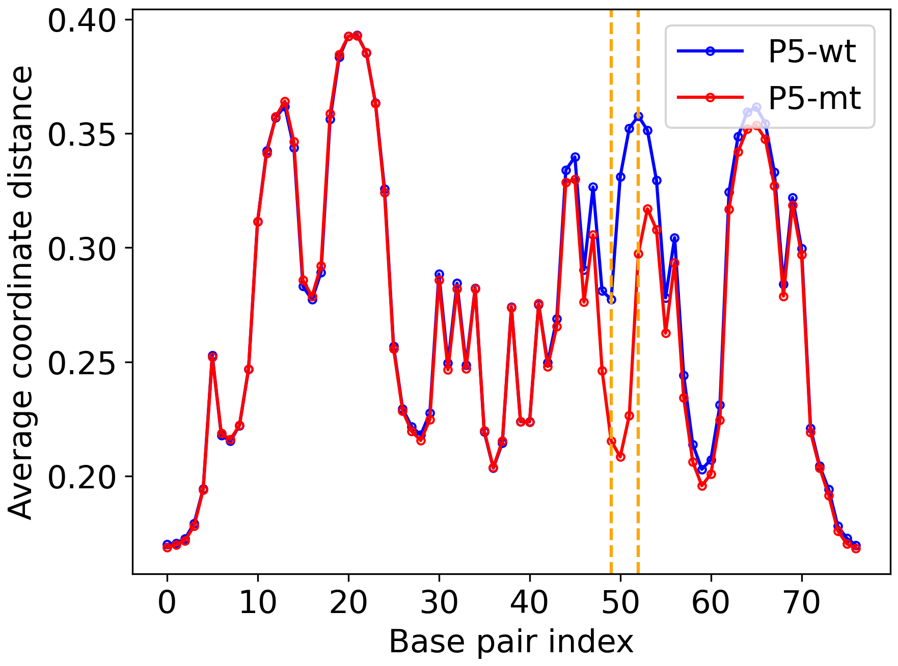
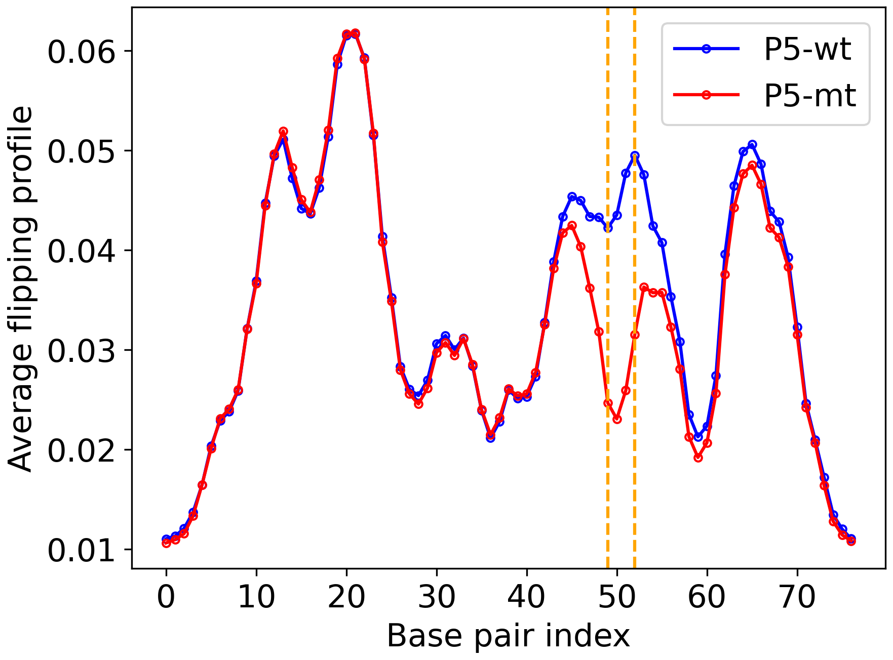

.. pyDNA-EPBD documentation master file, created by
   sphinx-quickstart on Mon Jul 31 12:21:40 2023.
   You can adapt this file completely to your liking, but it should at least
   contain the root `toctree` directive.
.. This file is copy of docs/source/index.rst, except the path of the figure and modules integration blocks.

Welcome to pyDNA-EPBD's documentation!
======================================
This repository corresponds to the article titled as **pyDNA-EPBD: A Python-based Implementation of the Extended Peyrard-Bishop-Dauxois Model for DNA Breathing Dynamics Simulation**.

|pic1|    |pic2|

**Background:** The dynamic behavior of DNA sequences, including local transient openings or *breathing* and *flipping*, is crucial in a wide range of biological processes and genomic disorders. However, accurate modeling and simulation of these phenomena, particularly for homogeneous and periodic DNA sequences, have remained a challenge due to the complex interplay of factors such as hydrogen bonding, electrostatic interactions, and base stacking.

**Results:** To address this, we have developed pyDNA-EPBD, a Python-based software tool that employs an extended version of the Peyrard–Bishop–Dauxois (EPBD) model. This extension integrates a sequence-dependent stacking term, enabling a more precise description of the DNA melting behavior for homogenous and periodic sequences. Through the use of a Monte Carlo Markov Chain (MCMC) approach, pyDNA-EPBD simulates DNA dynamics and generates data on DNA breathing characteristics such as bubble coordinates and flipping.

Resources
========================================
* `Paper <https://tobeprovided>`_
* `Documentation <https://tobeprovided>`_
* `Code <https://github.com/lanl/pyDNA_EPBD>`_
* `Analysis Notebooks <https://github.com/lanl/pyDNA_EPBD/tree/main/analysis>`_
* `Utility of ML models <https://github.com/lanl/pyDNA_EPBD/tree/main/models>`_
* `Example Runs <https://github.com/lanl/pyDNA_EPBD/tree/main/examples>`_ 

Installation
========================================
.. code-block:: console
      
      git clone https://github.com/lanl/pyDNA_EPBD.git
      cd pyDNA_EPBD
      conda create -c conda-forge --name pydnaepbd_pypy39_conda pypy python=3.9 -y
      conda activate pydnaepbd_pypy39_conda
      python setup.py install

      # Test to see if installation is successfull
      Type 'python' in the shell
      >>>> import pydna_epbd.version as v
      >>>> v.__version__
      '1.0.0'
      
      # To remove the conda venv
      conda deactivate
      conda remove --name pydnaepbd_pypy39_conda --all -y

Prerequisites
========================================
To run the simulation:
   * joblib>=1.3.0
   * numpy>=1.25.1

To analyze:
   * scikit-learn>=1.3.0
   * scipy>=1.11.1
   * pandas>=2.0.3
   * matplotlib>=3.7.2
   * seaborn>=0.12.2

Example DNA sequences, Configurations and Switches
========================================================
Input DNA sequences, simulation configurations and switches should be in place to run the MCMC simulation successfully. In the following, we give such examples:

*examples/p5/p5_seqs/p5_wt_mt.txt*

.. code-block:: console

      P5_wt GCGCGTGGCCATTTAGGGTATATATGGCCGAGTGAGCGAGCAGGATCTCCATTTTGACCGCGAAATTTGAACGGCGC
      P5_mt GCGCGTGGCCATTTAGGGTATATATGGCCGAGTGAGCGAGCAGGATCTCCGCTTTGACCGCGAAATTTGAACGGCGC

*examples/p5/chicoma_configs.txt*

.. code-block:: console
      
      IsFirstColumnId         Yes # Yes/No
      SequencesDir            inputs/p5_seqs/
      OutputsDir              outputs/
      SaveFull                No  # Yes/No. if No, the simulation will save the summary, No is space efficient.
      SaveRuntime             No  # Yes/No. if No, it will not write the runtime.
      Flanks                  None # flanks will be added to all the seq on both sides, 26 GCs, None will not add anything
      Temperature             310
      Iterations              100
      Preheating              50000
      StepsAfterPreheating    80000
      NNodes                  1 # Number of nodes to divide the sequences equally (--array in slurm script).

*pydna_epbd/configs/switches.py*

.. code-block:: python
      
      import os
      os.environ['BUBBLE_MONITOR'] = "True"
      os.environ['ENERGY_MONITOR'] = 'False'
      os.environ['COORD_MONITOR'] = "True"
      os.environ['FLIPPING_MONITOR'] = "False"
      os.environ['FLIPPING_MONITOR_VERBOSE'] = "True"
      os.environ['MELTING_AND_FRACTION_MONITOR'] = "False"
      os.environ['MELTING_AND_FRACTION_MANY_MONITOR'] = "False"

Example Usage
========================================
**Option 1: Using single computing node or local machine.** 
*python examples/p5/run.py*

.. code-block:: python
      
      import os
      import math
      import time
      import switch

      from input_reader import read_input_data
      from simulation.simulation_steps import run_sequences

      if __name__ == "__main__":
         """This runs the simulation given a configuration file."""
         job_idx = 0

         # array job
         if "SLURM_ARRAY_TASK_ID" in os.environ:
            job_idx = int(os.environ["SLURM_ARRAY_TASK_ID"])

         # InputConfigs class object
         input_configs = read_input_data("inputs/chicoma_configs.txt")

         # dividing the input sequences to the nodes based on job-idx
         chunk_size = math.ceil(len(input_configs.sequences) / input_configs.n_nodes)
         sequence_chunks = [
            input_configs.sequences[x : x + chunk_size]
            for x in range(0, len(input_configs.sequences), chunk_size)
         ]
         sequences = sequence_chunks[job_idx]
         print(f"job_idx:{job_idx}, n_seqs:{len(sequences)}")

         run_sequences(sequences, input_configs)

The above program will generate outputs in the *outputs* directory.

**Option 2: Using multiple computing nodes (slurm):**
By default, the above example script uses single node, which is slow for a large number of sequences. To avail multiple nodes, we suggest to define variables as follows:
First, a slurm script should define a `*--array*` variable.

.. code-block:: console

      #SBATCH --array=0-5 # i.e If six nodes are avilable

Then *NNodes* variable in the confiuration file should be the total number of nodes to use. For the above case: 

.. code-block:: console

      NNodes                  6

Now all the input DNA sequences will be divided into Six chunks to run independently in six computational nodes.
      

Acknowledgments
========================================
Los Alamos National Lab (LANL), T-1

Copyright Notice
========================================
© (or copyright) 2023. Triad National Security, LLC. All rights reserved. This program was produced under U.S. Government contract 89233218CNA000001 for Los Alamos National Laboratory (LANL), which is operated by Triad National Security, LLC for the U.S. Department of Energy/National Nuclear Security Administration. All rights in the program are reserved by Triad National Security, LLC, and the U.S. Department of Energy/National Nuclear Security Administration. The Government is granted for itself and others acting on its behalf a nonexclusive, paid-up, irrevocable worldwide license in this material to reproduce, prepare derivative works, distribute copies to the public, perform publicly and display publicly, and to permit others to do so.

License
========================================
This program is open source under the BSD-3 License.
Redistribution and use in source and binary forms, with or without modification, are permitted
provided that the following conditions are met:

1. Redistributions of source code must retain the above copyright notice, this list of conditions and
the following disclaimer.

2. Redistributions in binary form must reproduce the above copyright notice, this list of conditions
and the following disclaimer in the documentation and/or other materials provided with the
distribution.

3. Neither the name of the copyright holder nor the names of its contributors may be used to endorse
or promote products derived from this software without specific prior written permission.

THIS SOFTWARE IS PROVIDED BY THE COPYRIGHT HOLDERS AND CONTRIBUTORS "AS
IS" AND ANY EXPRESS OR IMPLIED WARRANTIES, INCLUDING, BUT NOT LIMITED TO, THE
IMPLIED WARRANTIES OF MERCHANTABILITY AND FITNESS FOR A PARTICULAR
PURPOSE ARE DISCLAIMED. IN NO EVENT SHALL THE COPYRIGHT HOLDER OR
CONTRIBUTORS BE LIABLE FOR ANY DIRECT, INDIRECT, INCIDENTAL, SPECIAL,
EXEMPLARY, OR CONSEQUENTIAL DAMAGES (INCLUDING, BUT NOT LIMITED TO,
PROCUREMENT OF SUBSTITUTE GOODS OR SERVICES; LOSS OF USE, DATA, OR PROFITS;
OR BUSINESS INTERRUPTION) HOWEVER CAUSED AND ON ANY THEORY OF LIABILITY,
WHETHER IN CONTRACT, STRICT LIABILITY, OR TORT (INCLUDING NEGLIGENCE OR
OTHERWISE) ARISING IN ANY WAY OUT OF THE USE OF THIS SOFTWARE, EVEN IF
ADVISED OF THE POSSIBILITY OF SUCH DAMAGE.

Authors
========================================
- `Anowarul Kabir <mailto:akabir4@gmu.edu>`_: Computer Sciece, George Mason University
- `Manish Bhattarai <mailto:ceodspspectrum@lanl.gov>`_: Theoretical Division, Los Alamos National Laboratory
- `Kim Rasmussen <mailto:kor@lanl.gov>`_: Theoretical Division, Los Alamos National Laboratory
- `Amarda Shehu <mailto:ashehu@gmu.edu>`_: Computer Sciece, George Mason University
- `Anny Usheva <mailto:Anny Usheva@brown.edu>`_: Surgery, Rhode Island Hospital and Brown University
- `Alan Bishop <mailto:arb@lanl.gov>`_: Theoretical Division, Los Alamos National Laboratory
- `Boian S. Alexandrov <mailto:boian@lanl.gov>`_: Theoretical Division, Los Alamos National Laboratory

How to Cite pyDNA-EPBD?
========================================

@software{pyDNA_EPBD,
  author       = {Kabir, Anowarul and 
                  Bhattarai, Manish and
                  Rasmussen, Kim and 
                  Shehu, Amarda and 
                  Usheva, Anny and 
                  Bishop, Alan and 
                  Alexandrov, Boian},
  title        = {ppyDNA-EPBD: A Python-based Implementation of the Extended Peyrard-Bishop-Dauxois Model for DNA Breathing Dynamics Simulation},
  month        = Aug,
  year         = 2023,
  publisher    = {Zenodo},
  version      = {v1.0.0},
  doi          = {10.5281/zenodo.5758446},
  url          = {https://doi.org/10.5281/zenodo.5758446}
}

