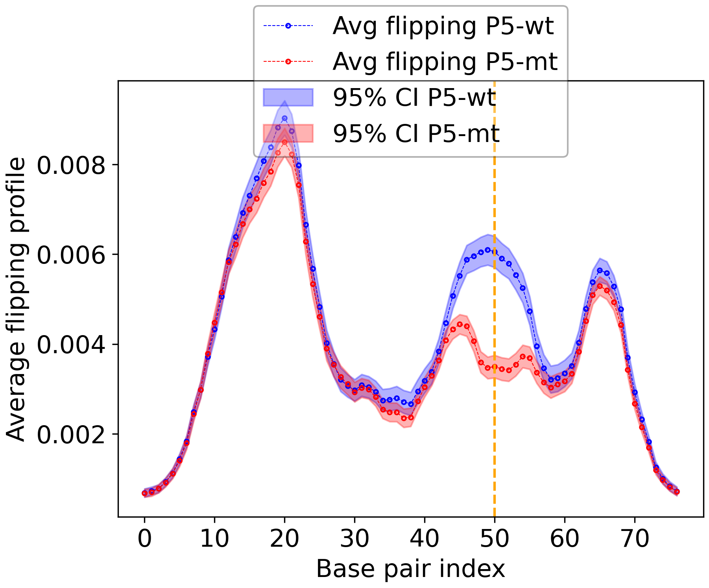
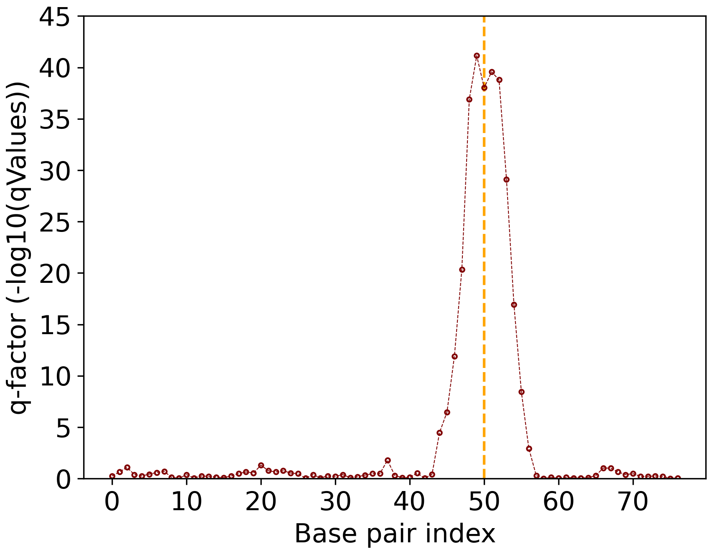
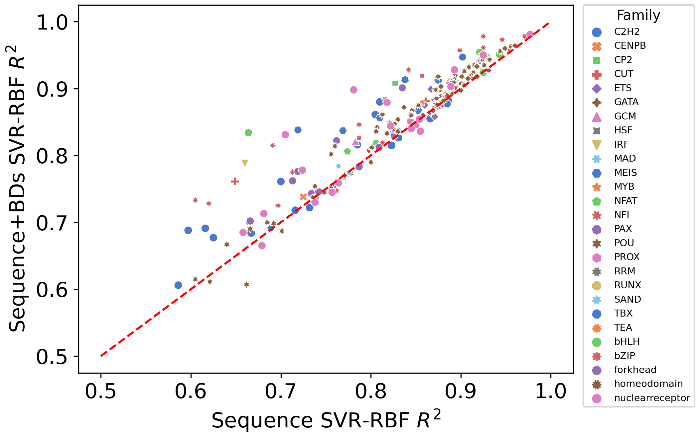
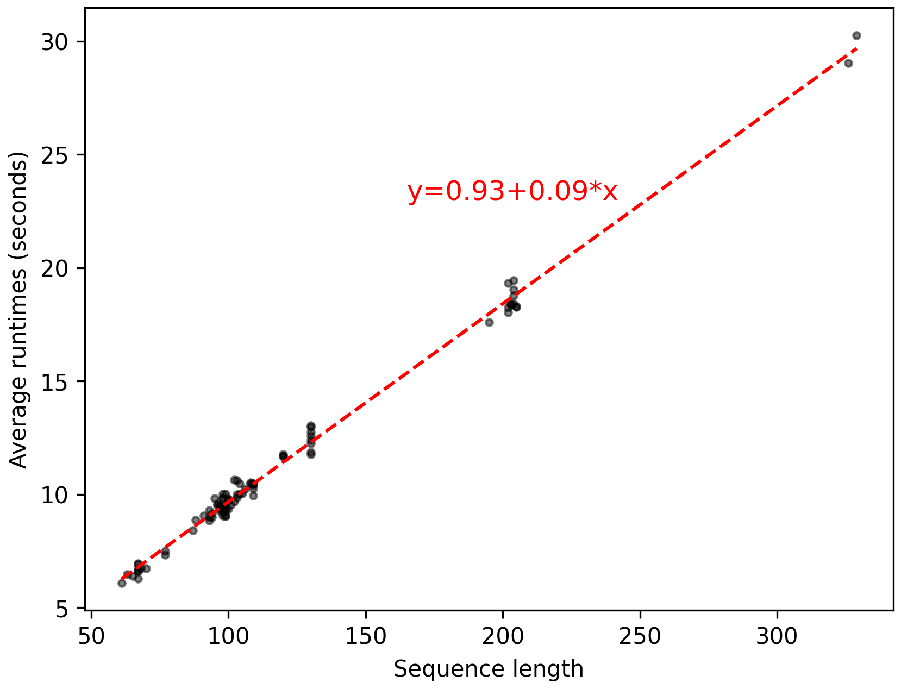
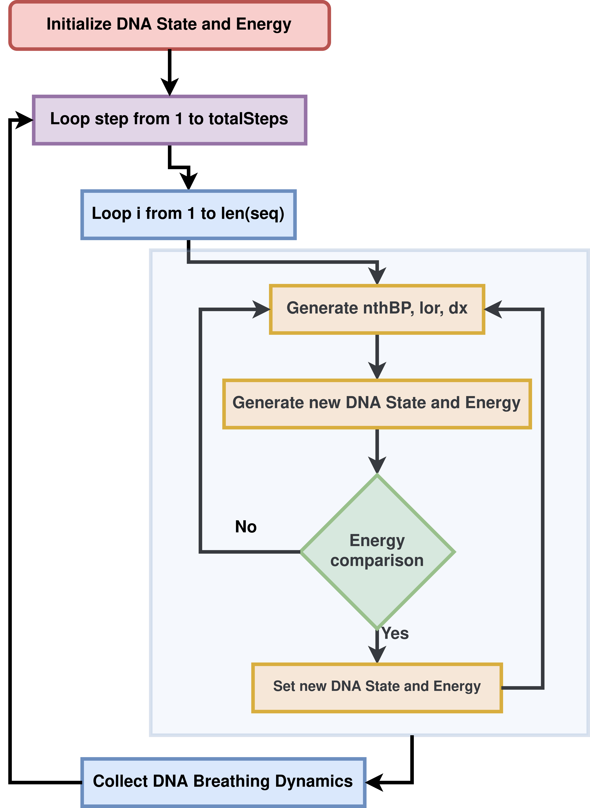

.. pyDNA-EPBD documentation master file, created by
   sphinx-quickstart on Mon Jul 31 12:21:40 2023.
   You can adapt this file completely to your liking, but it should at least
   contain the root `toctree` directive.

.. |pic2| image:: ../../plots/Bubbles.png
   :width: 45%

Welcome to pyDNA-EPBD's documentation!
======================================
This repository corresponds to the article titled as **pyDNA-EPBD: A Python-based Implementation of the Extended Peyrard-Bishop-Dauxois Model for DNA Breathing Dynamics Simulation**.

    
    Figure 1: Overview of the pyDNA-EPBD implementation.

The dynamic behavior of DNA sequences, including local transient openings or *breathing* and *flipping*, is crucial in a wide range of biological processes and genomic disorders. However, accurate modeling and simulation of these phenomena, particularly for homogeneous and periodic DNA sequences, have remained a challenge due to the complex interplay of factors such as hydrogen bonding, electrostatic interactions, and base stacking.
To address this, we have developed **pyDNA-EPBD**, a Python-based software tool that employs an extended version of the Peyrard–Bishop–Dauxois (EPBD) model. This extension integrates a sequence-dependent stacking term, enabling a more precise description of the DNA melting behavior for homogenous and periodic sequences. Through the use of a Monte Carlo Markov Chain (MCMC) approach, pyDNA-EPBD simulates DNA dynamics and generates data on DNA breathing characteristics such as bubble coordinates and flipping.

Resources
========================================
* `Paper <https://tobeprovided>`_
* `Code <https://github.com/lanl/pyDNA_EPBD>`_
* `Analysis Notebooks <https://github.com/lanl/pyDNA_EPBD/tree/main/analysis>`_
* `Utility of ML models <https://github.com/lanl/pyDNA_EPBD/tree/main/models>`_
* `Example Runs <https://github.com/lanl/pyDNA_EPBD/tree/main/examples>`_ 

Installation
========================================
.. code-block:: shell
      
      git clone https://github.com/lanl/pyDNA_EPBD.git
      cd pyDNA_EPBD
      conda create -c conda-forge --name pydnaepbd_pypy39_conda pypy python=3.9 -y
      conda activate pydnaepbd_pypy39_conda
      python setup.py install

      # Run your first pyDNA-EPBD simulation. 
      # This will generate P5 wild and mutant sequence breathing dynamics in the "outputs" directory.
      python pydna_epbd/run.py --config_filepath examples/p5/configs.txt

      # The other libraries to analyze the DNA breathing dynamics can be installed using the following command:
      conda install -c conda-forge scikit-learn scipy pandas matplotlib seaborn -y
      # The above libraries can be dependent on the following system environments.  
      sudo apt install libopenblas-dev  pkg-config libopenblas64-dev pypy-dev

      # To deactivate and remove the venv
      conda deactivate
      conda remove --name pydnaepbd_pypy39_conda --all -y

Prerequisites
========================================
To run the simulation:
   * argparse>=1.4.0
   * joblib>=1.3.0
   * numpy>=1.25.1

To analyze the DNA breathing dynamics (BD):
   * scikit-learn>=1.3.0
   * scipy>=1.11.1
   * pandas>=2.0.3
   * matplotlib>=3.7.2
   * seaborn>=0.12.2

Configuration file structure
========================================================
The simulation requires a configuration filepath. The structure of a configuration file is follows:

.. list-table:: Configuration file structure
   :widths: 20 10 70
   :header-rows: 1

   * - Keys
     - Options
     - Comments
   * - IsFirstColumnId
     - Yes/No
     - Whether or not the first column in the sequence file indicates sequence id.
   * - SaveFull
     - Yes/No
     - Whether or not save full simulation outputs. `No` is space efficient.
   * - SaveRuntime
     - Yes/No
     - Whether or not save runtime for each DNA sequence.
   * - SequencesDir
     - examples/p5/p5_seqs/
     - Directory that contains sequence file(s).
   * - OutputsDir
     - outputs/
     - Directory where pyDNA-EPBD saves outputs.
   * - Flanks
     - None
     - The flanks ('GC' like sequence) will be prepend and append with all input DNA sequences. 'None' will not add any.
   * - Temperature
     - 310
     - The simulation temperature in Kelvin scale.
   * - PreheatingSteps 
     - 50000
     - The number of preheating steps.
   * - PostPreheatingSteps
     - 80000
     - The number of post-preheating steps. Usually, the monitors record observations during the post-preheating steps.
   * - ComputingNodes
     - 1
     - Number of computing nodes available to run the simulation. This parameter is only be used while running the simulation with SLURM script.
   * - BubbleMonitor
     - On/Off
     - Whether or not record DNA bubble information.
   * - CoordinateMonitor
     - On/Off
     - Whether or not record coordinate information.
   * - FlippingMonitorVerbose
     - On/Off
     - Whether or not record flipping information for five different thresholds.
   * - FlippingMonitor
     - On/Off
     - Whether or not record flipping information for one threshold.
   * - EnergyMonitor
     - On/Off
     - Whether or not record energy information.
   * - MeltingAndFractionMonitor
     - On/Off
     - Whether or not record melting and fraction information for one threshold.
   * - MeltingAndFractionManyMonitor
     - On/Off
     - Whether or not record melting and fraction information for 20 thresholds at evenly separated 100 time steps.

Example Configurations and P5 DNA sequences
==============================================
The `example simulation run <https://github.com/lanl/pyDNA_EPBD#installation>`_ uses the following configuration file (`examples/p5/configs.txt <https://github.com/lanl/pyDNA_EPBD/blob/main/examples/p5/configs.txt>`_):

.. code-block:: console

      IsFirstColumnId = Yes
      SaveFull = No
      SaveRuntime = No
      SequencesDir = examples/p5/p5_seqs/
      OutputsDir = outputs/
      Flanks = None
      Temperature = 310
      Iterations = 100
      PreheatingSteps = 50000
      PostPreheatingSteps = 80000
      ComputingNodes = 1
      BubbleMonitor = On
      CoordinateMonitor = On
      FlippingMonitorVerbose = On
      FlippingMonitor = Off
      EnergyMonitor = Off
      MeltingAndFractionMonitor = Off
      MeltingAndFractionManyMonitor = Off

The input P5 DNA sequences (`examples/p5/p5_seqs/p5_wt_mt.txt <https://github.com/lanl/pyDNA_EPBD/blob/main/examples/p5/p5_seqs/p5_wt_mt.txt>`_) are:

.. code-block:: console

      P5_wt GCGCGTGGCCATTTAGGGTATATATGGCCGAGTGAGCGAGCAGGATCTCCATTTTGACCGCGAAATTTGAACGGCGC
      P5_mt GCGCGTGGCCATTTAGGGTATATATGGCCGAGTGAGCGAGCAGGATCTCCGCTTTGACCGCGAAATTTGAACGGCGC

Example Usage
========================================
**Option 1: Using single computing node:**

.. code-block:: console
      
      python pydna_epbd/run.py --config_filepath examples/p5/configs.txt

**Option 2: Using multiple computing nodes (SLURM):**
To avail multiple nodes, we suggest to define *--array* variable in a SLURM script:

.. code-block:: console

      #SBATCH --array=0-5 # i.e If six nodes are avilable

Then, *ComputingNodes* variable in the confiuration file should be the total number of nodes to use. For the above case: 

.. code-block:: console

      ComputingNodes = 6

Now all the input DNA sequences will be divided into Six chunks to run independently in six computational nodes.

Example SLURM script is given `here <https://github.com/lanl/pyDNA_EPBD/blob/main/examples/p5/chicoma_job.sh>`_ for P5.
Both options will generate outputs in the *outputs* directory.

.. |a| image:: ../../plots/p5_wtmt_avg_coord.png
.. |b| image:: ../../plots/p5_wtmt_avg_flip_1.414213562373096.png

.. list-table:: 
   :widths: 50 50
   :header-rows: 1

   * - Figure 2: Average coordinates.
     - Figure 3: Average flipping.
   * - |a|
     - |b|

Results
==================

  

Acknowledgments
========================================

Copyright Notice
========================================

License
========================================
This program is open source under the BSD-3 License.
Redistribution and use in source and binary forms, with or without modification, are permitted
provided that the following conditions are met:

1. Redistributions of source code must retain the above copyright notice, this list of conditions and
the following disclaimer.

2. Redistributions in binary form must reproduce the above copyright notice, this list of conditions
and the following disclaimer in the documentation and/or other materials provided with the
distribution.

3. Neither the name of the copyright holder nor the names of its contributors may be used to endorse
or promote products derived from this software without specific prior written permission.

THIS SOFTWARE IS PROVIDED BY THE COPYRIGHT HOLDERS AND CONTRIBUTORS "AS
IS" AND ANY EXPRESS OR IMPLIED WARRANTIES, INCLUDING, BUT NOT LIMITED TO, THE
IMPLIED WARRANTIES OF MERCHANTABILITY AND FITNESS FOR A PARTICULAR
PURPOSE ARE DISCLAIMED. IN NO EVENT SHALL THE COPYRIGHT HOLDER OR
CONTRIBUTORS BE LIABLE FOR ANY DIRECT, INDIRECT, INCIDENTAL, SPECIAL,
EXEMPLARY, OR CONSEQUENTIAL DAMAGES (INCLUDING, BUT NOT LIMITED TO,
PROCUREMENT OF SUBSTITUTE GOODS OR SERVICES; LOSS OF USE, DATA, OR PROFITS;
OR BUSINESS INTERRUPTION) HOWEVER CAUSED AND ON ANY THEORY OF LIABILITY,
WHETHER IN CONTRACT, STRICT LIABILITY, OR TORT (INCLUDING NEGLIGENCE OR
OTHERWISE) ARISING IN ANY WAY OUT OF THE USE OF THIS SOFTWARE, EVEN IF
ADVISED OF THE POSSIBILITY OF SUCH DAMAGE.

Documentation
==================
.. toctree::
   :maxdepth: 4

   modules/modules

Indices and tables
==================

* :ref:`genindex`
* :ref:`modindex`
* :ref:`search`

Authors
========================================
- `Anowarul Kabir <mailto:akabir4@gmu.edu>`_: Computer Sciece, George Mason University
- `Manish Bhattarai <mailto:ceodspspectrum@lanl.gov>`_: Theoretical Division, Los Alamos National Laboratory
- `Kim Rasmussen <mailto:kor@lanl.gov>`_: Theoretical Division, Los Alamos National Laboratory
- `Amarda Shehu <mailto:ashehu@gmu.edu>`_: Computer Sciece, George Mason University
- `Anny Usheva <mailto:Anny Usheva@brown.edu>`_: Surgery, Rhode Island Hospital and Brown University
- `Alan Bishop <mailto:arb@lanl.gov>`_: Theoretical Division, Los Alamos National Laboratory
- `Boian S. Alexandrov <mailto:boian@lanl.gov>`_: Theoretical Division, Los Alamos National Laboratory

How to Cite pyDNA-EPBD?
========================================

.. code-block:: console

      @software{pyDNA_EPBD,
      author       = {Kabir, Anowarul and 
                        Bhattarai, Manish and
                        Rasmussen, Kim and 
                        Shehu, Amarda and 
                        Usheva, Anny and 
                        Bishop, Alan and 
                        Alexandrov, Boian},
      title        = {ppyDNA-EPBD: A Python-based Implementation of the Extended Peyrard-Bishop-Dauxois Model for DNA Breathing Dynamics Simulation},
      month        = Aug,
      year         = 2023,
      publisher    = {Zenodo},
      version      = {v1.0.0},
      doi          = {10.5281/zenodo.5758446},
      url          = {https://doi.org/10.5281/zenodo.5758446}
      }